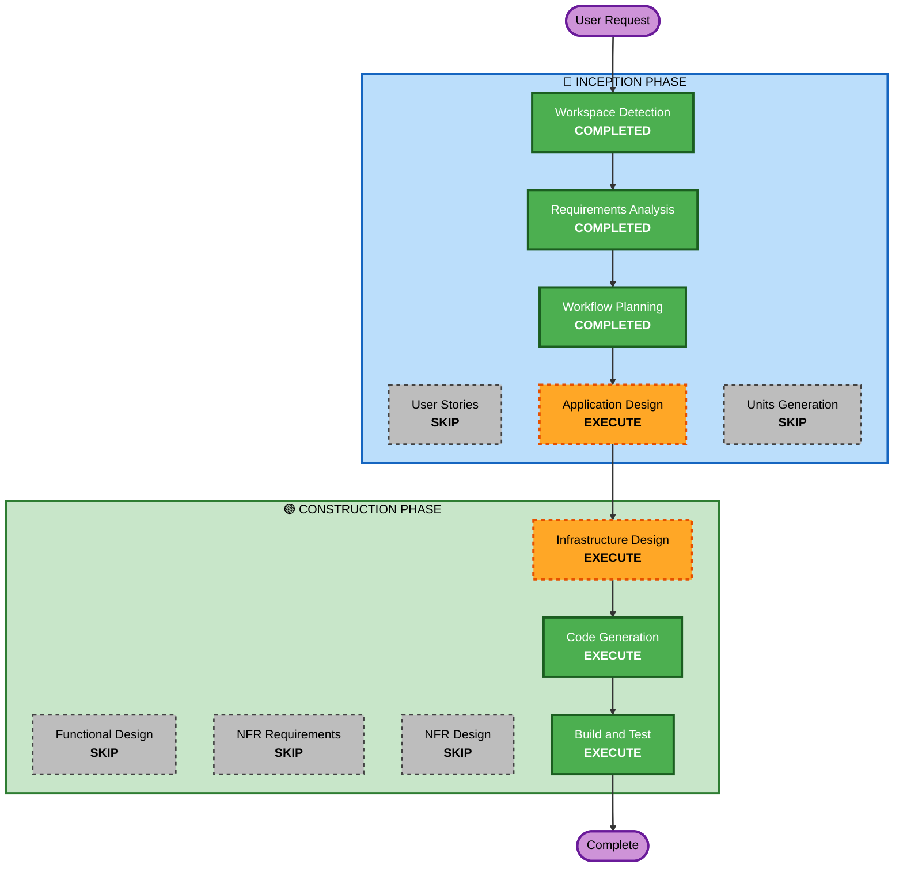

# Execution Plan

## Detailed Analysis Summary

### Change Impact Assessment
- **User-facing changes**: Yes — New web calculator UI
- **Structural changes**: Yes — Entirely new application (frontend + backend + infra)
- **Data model changes**: No — Stateless application, no data persistence
- **API changes**: Yes — New REST API endpoint for calculations
- **NFR impact**: Minimal — Low traffic demo project, no special NFR concerns

### Risk Assessment
- **Risk Level**: Low — Simple business logic, well-understood architecture, no data persistence
- **Rollback Complexity**: Easy — Greenfield project, destroy CDK stack to rollback
- **Testing Complexity**: Simple — Basic arithmetic operations, single API endpoint

## Workflow Visualization



### Text Alternative
```
Phase 1: INCEPTION
  - Workspace Detection (COMPLETED)
  - Requirements Analysis (COMPLETED)
  - User Stories (SKIP)
  - Workflow Planning (COMPLETED)
  - Application Design (EXECUTE)
  - Units Generation (SKIP)

Phase 2: CONSTRUCTION (Single Unit)
  - Functional Design (SKIP)
  - NFR Requirements (SKIP)
  - NFR Design (SKIP)
  - Infrastructure Design (EXECUTE)
  - Code Generation (EXECUTE)
  - Build and Test (EXECUTE)
```

## Phases to Execute

### 🔵 INCEPTION PHASE
- [x] Workspace Detection (COMPLETED)
- [x] Requirements Analysis (COMPLETED)
- [x] User Stories — SKIP
  - **Rationale**: Single user type (anonymous user), simple interactions (enter numbers, click operation, see result). No complex user journeys or personas to model.
- [x] Workflow Planning (COMPLETED)
- [ ] Application Design — EXECUTE
  - **Rationale**: New multi-component system (frontend, backend API, Lambda function, CDK infrastructure). Need to define component boundaries, API contract, and service layer design.
- [ ] Units Generation — SKIP
  - **Rationale**: Small enough to implement as a single unit of work. Frontend, backend, and infrastructure are tightly coupled and simple enough to build together.

### 🟢 CONSTRUCTION PHASE (Single Unit)
- [ ] Functional Design — SKIP
  - **Rationale**: Business logic is trivial (basic arithmetic). No complex data models, state machines, or business rules to design.
- [ ] NFR Requirements — SKIP
  - **Rationale**: Low traffic demo project. No special performance, security (extensions disabled), or scalability requirements beyond defaults.
- [ ] NFR Design — SKIP
  - **Rationale**: NFR Requirements skipped, so NFR Design is not applicable.
- [ ] Infrastructure Design — EXECUTE
  - **Rationale**: AWS infrastructure needs explicit design — S3 bucket, CloudFront distribution, API Gateway, Lambda function, IAM roles, CDK stack structure.
- [ ] Code Generation — EXECUTE (ALWAYS)
  - **Rationale**: Implementation of frontend, backend Lambda, and CDK infrastructure code.
- [ ] Build and Test — EXECUTE (ALWAYS)
  - **Rationale**: Build instructions, deployment steps, and test procedures needed.

### 🟡 OPERATIONS PHASE
- [ ] Operations — PLACEHOLDER
  - **Rationale**: Future deployment and monitoring workflows.

## Success Criteria
- **Primary Goal**: Working web calculator accessible via CloudFront URL that performs basic arithmetic via serverless backend
- **Key Deliverables**:
  - Static HTML/CSS/JS calculator frontend
  - Python Lambda function for computation
  - CDK infrastructure stack
  - Build and deployment instructions
- **Quality Gates**:
  - Calculator UI renders correctly
  - API returns correct results for all 4 operations
  - CDK stack deploys successfully
  - Division by zero handled gracefully
